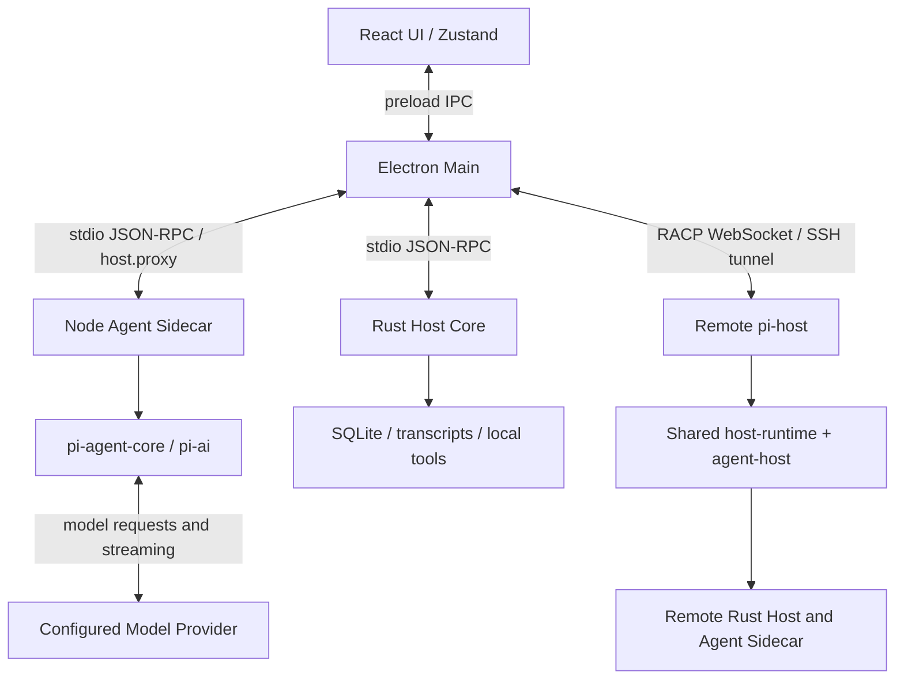

# PI-Desktop project summary

## Project and source baseline

PI-Desktop is a local-first desktop workbench for AI coding agents. It combines
project/session management, streamed conversations, Agent/Plan/Goal workflows,
local tools, subagents, model providers, plugins, Skills, MCP, and remote hosts.

- Source: [AR307/PI-Desktop](https://github.com/AR307/PI-Desktop).
- Upstream: [vastsa/PI-Desktop](https://github.com/vastsa/PI-Desktop).
- Reviewed on: 2026-09-20.
- Reviewed revision: `996922fa729870e88ed9e439aa6959e388c12f91`.
- Application version: `0.15.1`; license: LGPL-3.0-or-later.
- Both remote HEADs matched this revision when checked before cloning.
- The supplied link's display text named `oh-my-pi`, but its actual target was
  `PI-Desktop`; this checkout follows the actual link target.
- The existing GitHub fork is the remote source/archive. The full Git history
  was cloned, `origin` retained, and `upstream` added locally.

This document records source inspection, not a successful application run.

## Code architecture

The repository is a pnpm workspace for TypeScript and a Cargo workspace for Rust.
The main product has three cooperating process roles: Electron, a Rust host
child, and a Node agent sidecar. The renderer is sandboxed and calls a preload
bridge instead of accessing Node or the database directly.

| Location | Responsibility and useful entry points |
| --- | --- |
| [apps/desktop/src](apps/desktop/src) | React UI, Zustand state, conversation rendering, settings, and project interaction. Start at `main.tsx`, `App.tsx`, and `features/app/AppShell.tsx`. |
| [apps/desktop/electron](apps/desktop/electron) | Electron windows, preload, IPC, desktop services, plugins, and local/remote routing. `main/index.ts` assembles `bootstrap/`, `ipc/`, `runtime/`, and `services/`. |
| [crates/host-core/src](crates/host-core/src) | Rust executable `pi-desktop-host-core`: SQLite, managed sessions/transcripts, filesystem/shell tools, permissions, providers, and plugin records. Entry: `main.rs` -> `rpc/mod.rs`. |
| [packages/agent-runtime/src](packages/agent-runtime/src) | Node sidecar and pi execution: provider binding, streaming, context/compaction, instructions, subagents, and tool bridge. Entries: `sidecar.ts` and `runtime.ts`. |
| [packages/host-runtime/src](packages/host-runtime/src) | Electron-independent child-process transports, process supervision, turn execution/persistence, and headless launch resolution. |
| [packages/agent-host/src](packages/agent-host/src) | Host-facing session execution API, turn admission/queue, approval handling, and event log. Main class: `AgentHost`. |
| [apps/pi-host/src](apps/pi-host/src) and [packages/racp/src](packages/racp/src) | Headless host CLI and remote-control WebSocket protocol. `app.ts` composes shared runtime services; desktop `main/remote/` provides its client and SSH integration. |
| [packages/shared/src](packages/shared/src) | Cross-process types, IPC names, error definitions, settings/models, and shared transformations. |
| [packages/plugin-sdk/src](packages/plugin-sdk/src) and [packages/plugin-devkit/src](packages/plugin-devkit/src) | Plugin contracts/validators and the `pi-plugin` scaffold/check/pack/publish CLI. Desktop supplies plugin execution and UI hosting. |
| [packages/i18n/src](packages/i18n/src) | Locale catalogs and language helpers. |
| [docs](docs), [scripts](scripts), and [examples](examples) | VitePress documentation/specs/ADRs, development and E2E scripts, sample plugins, and fixtures. |

The sidecar requests host capabilities through `ParentHostProxy`. The embedding
process routes those requests to Rust or to its own desktop services. It does
not create a second Rust database owner. Desktop and headless operation share
the transport/runtime packages, but desktop prompt preparation still has its
own orchestration for attachments, plugins, MCP, and vendor accounts.

## One prompt through the system

1. `apps/desktop/src/stores/slices/queue-slice.ts` implements `sendPrompt` and
   calls `api.prompt` in `src/lib/api.ts`. Active sessions can enqueue work.
2. `electron/preload/index.ts` exposes `window.piDesktop`; the request reaches
   `electron/main/ipc/agent-ipc.ts` using the shared `agentPrompt` IPC channel.
3. For desktop-managed sessions, main resolves session/provider/context inputs,
   creates the durable turn, and appends the user message through Rust before
   calling sidecar `agent.prompt`.
4. `packages/agent-runtime/src/sidecar.ts` selects the session runtime, whose
   `runtime.ts` drives pi agent execution and streams normalized events.
5. `electron/main/runtime/sidecar.ts` relays events to the renderer;
   `runtime/event-persistence.ts` coordinates stored conversation updates.
   Renderer `stores/slices/events-slice.ts` updates the displayed conversation.

Native Pi sessions use the separate `native-pi:` route in
`packages/agent-runtime/src/native-pi-session.ts`, backed by Pi session files.
Changes to desktop-managed sessions should not assume that native continuation
or remote sessions use exactly the same execution path.

## Dependencies, development, and packaging

- Root [package.json](package.json): Node `>=22.19.0`, pinned pnpm `11.18.0`.
- Desktop manifest: Electron `^43.4.1`, React `^19.2.8`, TypeScript `^5.9.3`,
  electron-vite, Zustand, Tailwind CSS, and i18next.
- Agent packages pin `@earendil-works/pi-agent-core`, `pi-ai`, and
  `pi-coding-agent` to `0.85.1`.
- [pnpm-workspace.yaml](pnpm-workspace.yaml) applies local pi patches from
  [patches](patches). Inspect these when changing agent/provider behavior or
  updating pi; the project does not use unmodified upstream packages.
- Rust uses Tokio and bundled SQLite through rusqlite. Windows targets MSVC.
- `rtk pnpm install --frozen-lockfile` installs the workspace after selecting a
  compatible Node runtime.
- `rtk pnpm dev` invokes desktop `predev`, which builds its JS dependencies
  and Rust host, then launches `scripts/dev-electron.mjs`.
- `rtk pnpm build:js` builds JS workspace packages;
  `rtk cargo build -p host-core` builds the Rust host.
- Desktop `pack`/`dist` scripts additionally build the release host and bundle
  the agent sidecar before running electron-builder. Windows targets are x64
  NSIS and portable EXE; macOS and Linux targets are also defined.

Data roots are resolved by
[electron/main/data-paths.ts](apps/desktop/electron/main/data-paths.ts):
packaged installations use `~/.pi-desktop`, development uses
`~/.pi-desktop-dev`, and `PI_DESKTOP_DATA_DIR` can select an explicit profile.
Rust owns `pi.sqlite`; runtime data, credentials, and generated output do not
belong in project commits.

## Where future improvements belong

| Requested change | Primary implementation area | Representative usage to verify |
| --- | --- | --- |
| Chat layout, input, rendering, navigation | Renderer `features/`, `components/`, `stores/slices/`, and `styles/` | Send a prompt, read a streaming response, switch sessions, resize the window. |
| Provider connectivity or resilience during network fluctuations | Agent `provider-retry.ts`, `provider-transport-recovery.ts`, `node-proxy.ts`, and `provider-binding.ts` | Temporary disconnect/rate limit during a real turn; observe recovery and stop behavior. |
| Agent context, instructions, compaction, delegation | `packages/agent-runtime/src/` | Continue a long conversation, invoke a tool, and follow a delegated task. |
| Local files, shell execution, persistence | Rust `tools/`, `sessions.rs`, `transcripts.rs`, and `db/`, with corresponding shared contracts | Open a project, execute the affected operation, reopen the session. |
| Plugins, Skills, or MCP | Existing desktop domain services, Rust plugin modules, SDK, and runtime bridges | Install/enable the affected capability and invoke it from its actual UI or agent entry. |
| Remote workspaces | Desktop `main/remote/`, `apps/pi-host/`, `packages/racp/`, and shared runtime | Connect to a host, run a task, disconnect/reconnect, inspect its conversation. |

Source inspection already found provider retry and transport-rebuild modules;
network recovery work should start there. Their presence is not proof that all
failure scenarios work. No network-failure experiment was run in this task.

The renderer already has feature modules and store slices. Several backend
files remain large: `rpc/mod.rs` has 8,679 lines, agent `runtime.ts` 7,683,
`sessions.rs` 6,131, and desktop `plugin-runtime.ts` 5,655 at the reviewed
revision, including inline tests where present. These are navigation and
maintenance hotspots, not measured performance defects. Improve the module
needed by an actual request rather than starting a repository-wide rewrite.

## Onboarding verification and current readiness

- Full, non-shallow clone completed; source revision and workspace manifests
  checked. The original `main` checkout had no local modifications.
- Default shell Node is `22.12.0`, below the declared requirement. An existing
  bundled Node `24.19.0` was located, and pnpm `11.18.0` successfully executed
  with that Node selected for the child shell. No global toolchain was changed.
- Rust/cargo `1.86.0`, the Windows MSVC target, and Visual Studio 2022 C++ tools
  were detected. Dependency compatibility is not established by detection.
- Dependencies have not been installed. Application compilation, desktop
  launch, visual interaction, E2E, remote connection, and real provider calls
  have not been run. This is an architecture baseline, not runtime acceptance.
- Existing user-path checks include `test:e2e:boot`, `test:e2e:transcript`,
  `test:e2e:composer-paste`, `test:e2e:subagents`, and `test:e2e:remote-host`.
  Select checks around the requested behavior when implementation starts.
- Repository workflow documentation has drift: root `AGENTS.md` forbids local
  main as an integration branch, while parts of `docs/spec/06-delivery/` still
  describe local-main integration. This onboarding follows root policy and
  keeps its documentation on `docs/architecture-onboarding` in a dedicated
  worktree. No delivery-policy files were rewritten.

## Update log

### 2026-09-20 - Initial architecture onboarding

- Cloned the requested GitHub fork and retained its full history.
- Added this source-backed map of packages, process boundaries, prompt flow,
  development commands, and concrete improvement entry points.
- Recorded actual toolchain checks and the untested runtime scope.
- Documentation-only change; no application behavior changed. Delivery is a
  local commit only, with no push or pull request.
