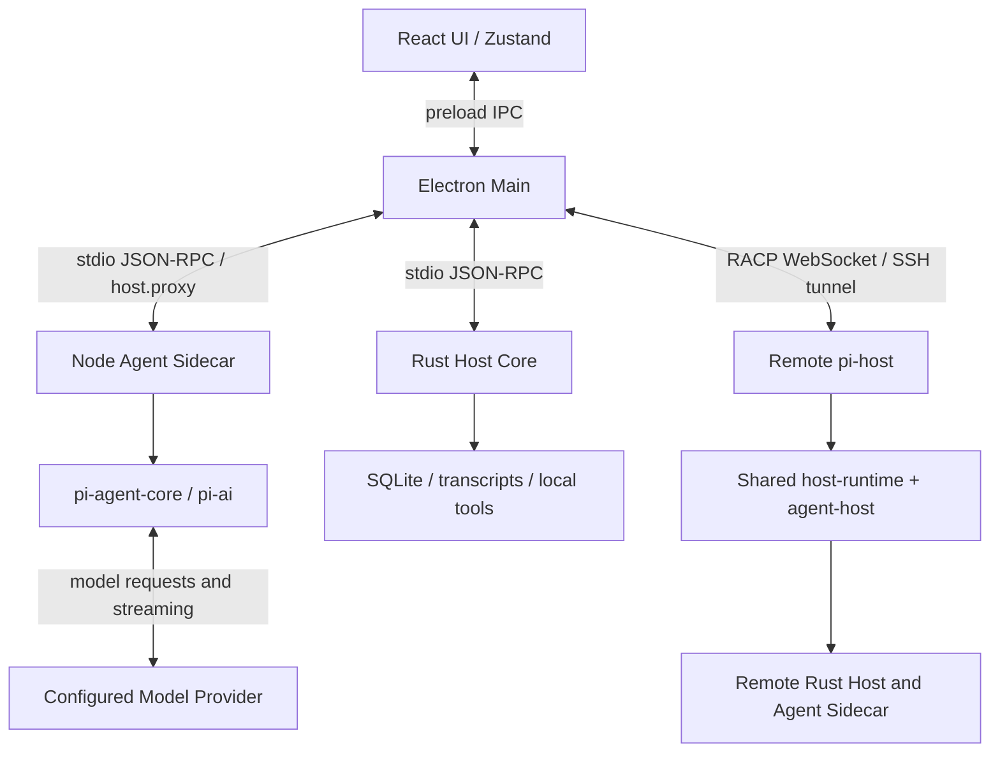

# PI-Desktop project summary

## 2026-09-23 - MirrorCoding relay 502 recovery

- Scoped MirrorCoding relay credentials by provider, session, group, model, and
  endpoint so model/protocol switches cannot reuse an incompatible binding.
- Normalized MirrorCoding model IDs across the provider catalog, relay guard,
  session launch, sidecar, and delegated subagent providers; managed groups now
  remain distinct even when they share the `mirrorcoding` vendor key.
- Sent text relay bodies as strings and image edit bodies as `Uint8Array`, and
  added relay-stage/cause diagnostics for connection failures without exposing
  request content or credentials.
- Added regressions for cross-provider delegation, model-local context limits,
  model/protocol binding isolation, and relay body types.
- Validation: Shared tests 954/954, MirrorCoding relay/subagent tests 7/7,
  MirrorCoding recovery E2E 28/28, desktop/shared/agent-runtime typechecks,
  workspace JavaScript build, and desktop production build passed. The full
  Agent Runtime suite still has 13 unrelated Windows native-session fixture
  failures plus a missing external coding-agent dist-root fixture.
- Added the 0.15.3 shipped-locale release notes; the release documentation
  check and changelog alignment tests now pass.

## 2026-09-23 — Full local test pass

- Host acceptance scripts now handshake at the shared protocol version, which
  is 12. Plan mode ran 13 scenarios. The upstream image batch ran against a
  local server. Playwright drove the composer through login, the image menu,
  and group billing, then stopped on the removed quality control.

## 2026-09-22 — Image model list

- The composer no longer shows “登录 MirrorCoding 后，选择可用的生图模型。”
- Account models whose ids contain image or imagine are listed for image
  generation even when the catalog omits an image capability. Video ids stay
  out. A bad image object no longer drops the rest of the catalog.

## 2026-09-22 — Local 0.15.3 installer

- Package version is 0.15.3 on `feat/plan-ask-mirrorcoding`. The Windows setup
  is `apps/desktop/release/PI-Desktop-Setup-0.15.3.exe`. It was not published.
- The installer was not exercised through the Electron image acceptance flow.
  That flow still expects the previous size, quality, and single-request body.

## 2026-09-22 — Composer image mode uses the upstream batch

- The composer image mode is labeled 生图. It still lists every MirrorCoding
  image model by group. A route other than `/v1/images/generations` or
  `/v1/images/edits` stays visible and cannot be sent.
- Sending calls `generateImageBatch` through the local account relay. Each
  image is `model`, `prompt`, and `n: 1`. Reference images use multipart edits.
  Size, quality, and ratio are not sent, and no copied API key is required.
- The sidecar `mirrorcoding-images` request path is removed. Settings image
  models and the agent `GenerateImages` tool are unchanged.

## 2026-09-22 — Plan questions and MirrorCoding runtime parity

- Plan mode asks `asktool` about uncertainties that would change the plan, then
  submits one plan after the answers. Pending approval still does not wait on
  chat confirmation.
- MirrorCoding chat sessions use the same retry, empty-response rerun, progress
  nudge, overflow recovery, and subagent fallback as a manually imported
  provider. The local relay forwards the sidecar's upstream headers and still
  keeps the account credential.

## 2026-09-22 — Fork experience: updates, models, subagents, icon, images

- In-app updates and bug reports now target `AR307/PI-Desktop`. Remote-host
  bundles still download from the upstream release that publishes them.
- Settings lists each signed-in MirrorCoding group with the same model panes.
  Account rows have no API key, base URL, or delete. Catalog refresh keeps a
  user's context window, max tokens, thinking levels, and subagent switch.
- Connected MirrorCoding chat models can be delegated, including model A
  spawning model B. Image models stay out of that list.
- Windows windows look up `apps/desktop/build/icon.ico` from the app directory.
- Ordinary quit no longer installs a downloaded update. The close-and-reopen
  crash matched a silent NSIS install racing the next launch.
- A chat model selection becomes the next session's default. Image selection
  does not. Plan and goal markdown open in the host preview.

## 2026-09-22 — Sync upstream/main and keep the fork

- Merged `upstream/main` (`b10325837`) into `sync/upstream-main` from
  `origin/main` (`351d30831`). The fork point remains `996922fa`.
- Kept the local MirrorCoding account and grouped models, MirrorCoding image
  generation, the Android companion and MC relay, work-panel browser drag and
  resize, and pending Plan/Goal approvals after planning finishes.
- Kept upstream image generation (`packages/agent-runtime/src/image-generation`)
  beside the MirrorCoding image path. The two pipelines stay separate.
- Upstream since the fork is now the baseline: encrypted config sync, scheduled
  automations, crash reports, transcript disclosure, and the 0.15.2 fixes.

## 2026-09-21 — Android companion implementation

- Created the independent `codex/mobile-companion` worktree from current
  `origin/main` (`996922fa`) and incorporated the committed desktop account,
  window fixes, and image-generation baseline (`8834fc5f`).
- Added the MC-team requirements handoff, scoped online-sync domain spec and
  architecture decision. MC retains device/grant metadata; desktop owns
  transcripts, attachments and all task execution.
- Exposed browser-safe RACP client/framing entry points and shared the protocol
  error class between browser and Host. Existing RACP suite: 21 tests passed.
- Desktop share UI, scoped relay and React/Capacitor Android implementation are
  being integrated. Actual Electron/Android acceptance will be recorded below;
  MC production service deployment is a separate team's deliverable.

### Desktop sync implementation

- Added opt-in project/session sharing, centered pairing dialogs and the account
  page's mobile device manager. Main owns the outbound MC relay; the restricted
  mobile peer checks current sharing scope for history, commands and attachments.
- Reused AgentHost queues, permission/plan approvals and questions. Mobile Stop
  uses the same immediate interruption path as the desktop composer. Client
  message IDs remain stable through the Rust-backed queue and process restart.
- Reused ImageService for mobile generation and result downloads. Admission now
  acknowledges only after parameter validation and user-message persistence so
  an invalid image request retains the mobile draft and reference images.
- Kept attachment access tied to explicit session messages and chunked transfer.
  Session history uses Rust's bounded query instead of loading every message.
- AgentHost 26 tests, host ports 4 tests, Rust queue 10 tests, shared 876 tests,
  RACP 21 tests and i18n 25 tests passed. Desktop production build, typecheck,
  repository lint and Rust formatting passed; Clippy completed with one existing
  unrelated `user_skills.rs` warning.
- Real isolated Electron/mobile browser flows have exercised pairing, scope
  isolation, history, continuation, queues, immediate stop, questions, approval,
  photos, reconnect, image generation, restart and revocation. Final candidate
  counts and native Android acceptance are recorded after the remaining checks.

### Android client implementation

- Added a React/Capacitor 8 application targeting Android SDK 36 (minimum 24),
  using PI's design tokens, launcher assets, English/Chinese and light/dark UI.
- Native secure storage retains mobile credentials without storing passwords.
  Views cover pairing, shared work, history, tools, plans, questions, approvals,
  queue state, chat continuation and desktop-selected image generation.
- System file picking, chunked upload, image preview, save/share and reference
  reuse work through the same scoped desktop connection. Drafts survive network
  reconnect and foreground return; uncertain submissions are checked on desktop.
- Fixed browser fetch binding, transient send acknowledgement recovery, live
  mode updates, snapshot/stream merging, Android Back and persistent send errors
  found while exercising actual interfaces. No separate mobile agent exists.
- Mobile typecheck and five service/user-path tests passed. Scoped Biome lint
  checked 21 mobile and locale files. Native APK runs have already exercised
  login, pairing, continuation, keyboard layout, foreground restore, native file
  picking, image generation, preview, share and reference reuse. Final native
  restart/visual evidence and the installable package are recorded next.

### Android visual refinement

- Native acceptance on Android 15 / WebView 124 passed 19 checks, including real
  secure credential recovery after force-stop/relaunch, native picker and share,
  reference generation, foreground reconnect and Back navigation.
- Screenshot review found light system-bar gutters around the dark application.
  The existing Capacitor SystemBars API now follows the chosen theme, with a
  small Android appearance bridge for older WebViews' native inset background.
  Removed the conflicting legacy fullscreen keyboard-resize option and use
  Capacitor's safe-area values. Final native validation reruns this refinement.

### Plan approval recovery

- The expanded real desktop/phone scenario reproduced a pending plan disappearing
  when its planning turn finished. AgentHost now closes only turn-bound tool
  approvals at turn completion and restores durable Plan/Goal approvals from
  Rust during snapshots for phone reconnect or AgentHost recreation while the
  Rust host remains available. Full desktop restart retains the existing Rust
  behavior of marking pending proposals interrupted; it does not leave those
  proposals available for approval.
- Added regressions that fail on the previous lifecycle and pass after the fix:
  32 AgentHost/approval checks passed, followed by all 21 RACP checks. AgentHost,
  RACP and Electron were rebuilt before rerunning the visible approval flow.

- Native screenshot review also caught a launch-theme action bar appearing when
  Android edge-to-edge initialization ran before Capacitor applied NoActionBar.
  Initialization now runs after the bridge activity's theme setup.

### Final companion acceptance and delivery

- Executable candidate `d2e5917ef4ac8558e40196e9f4446c1f1278249c`, base main
  `996922fa729870e88ed9e439aa6959e388c12f91`; refreshed origin/main is unchanged.
- Actual isolated Electron/touch-browser acceptance passed all 41 checks without
  renderer/cleanup errors. Actual Android 15/WebView 124 acceptance passed all
  19 checks, including native secure storage, picker/share, keyboard, reference
  generation and process restart. Settled EN/ZH light/dark screenshots were
  reviewed, with the corrected native header and system bars.
- Rebuilt the official-origin preview APK, installed it and verified the native
  login screen with no acceptance hooks and no production login submission.
  Package and reports live under `D:/piformc-artifacts/mobile-companion`.
- Workspace package builds, desktop/mobile typechecks and builds, relevant
  tests and lint passed as detailed in `docs/mobile-companion-delivery.md`.
  MC-team integration, physical-device coverage and production deployment remain
  external acceptance. All implementation commits stay local in this worktree.

## Project and source baseline

PI-Desktop is a local-first desktop workbench for AI coding agents. It combines
project/session management, streamed conversations, Agent/Plan/Goal workflows,
local tools, subagents, model providers, plugins, Skills, MCP, and remote hosts.

- Source: [AR307/PI-Desktop](https://github.com/AR307/PI-Desktop).
- Upstream: [vastsa/PI-Desktop](https://github.com/vastsa/PI-Desktop).
- Reviewed on: 2026-09-20.
- Reviewed revision: `996922fa729870e88ed9e439aa6959e388c12f91`.
- Application version: `0.15.1`; license: LGPL-3.0-or-later.
- Both remote HEADs matched this revision when checked before cloning.
- The supplied link's display text named `oh-my-pi`, but its actual target was
  `PI-Desktop`; this checkout follows the actual link target.
- The existing GitHub fork is the remote source/archive. The full Git history
  was cloned, `origin` retained, and `upstream` added locally.

The onboarding sections below record the initial source inspection. Current
implementation and actual runtime evidence appear in the update log.

## Code architecture

The repository is a pnpm workspace for TypeScript and a Cargo workspace for Rust.
The main product has three cooperating process roles: Electron, a Rust host
child, and a Node agent sidecar. The renderer is sandboxed and calls a preload
bridge instead of accessing Node or the database directly.

| Location | Responsibility and useful entry points |
| --- | --- |
| [apps/desktop/src](apps/desktop/src) | React UI, Zustand state, conversation rendering, settings, and project interaction. Start at `main.tsx`, `App.tsx`, and `features/app/AppShell.tsx`. |
| [apps/desktop/electron](apps/desktop/electron) | Electron windows, preload, IPC, desktop services, plugins, and local/remote routing. `main/index.ts` assembles `bootstrap/`, `ipc/`, `runtime/`, and `services/`. |
| [crates/host-core/src](crates/host-core/src) | Rust executable `pi-desktop-host-core`: SQLite, managed sessions/transcripts, filesystem/shell tools, permissions, providers, and plugin records. Entry: `main.rs` -> `rpc/mod.rs`. |
| [packages/agent-runtime/src](packages/agent-runtime/src) | Node sidecar and pi execution: provider binding, streaming, context/compaction, instructions, subagents, and tool bridge. Entries: `sidecar.ts` and `runtime.ts`. |
| [packages/host-runtime/src](packages/host-runtime/src) | Electron-independent child-process transports, process supervision, turn execution/persistence, and headless launch resolution. |
| [packages/agent-host/src](packages/agent-host/src) | Host-facing session execution API, turn admission/queue, approval handling, and event log. Main class: `AgentHost`. |
| [apps/pi-host/src](apps/pi-host/src) and [packages/racp/src](packages/racp/src) | Headless host CLI and remote-control WebSocket protocol. `app.ts` composes shared runtime services; desktop `main/remote/` provides its client and SSH integration. |
| [packages/shared/src](packages/shared/src) | Cross-process types, IPC names, error definitions, settings/models, and shared transformations. |
| [packages/plugin-sdk/src](packages/plugin-sdk/src) and [packages/plugin-devkit/src](packages/plugin-devkit/src) | Plugin contracts/validators and the `pi-plugin` scaffold/check/pack/publish CLI. Desktop supplies plugin execution and UI hosting. |
| [packages/i18n/src](packages/i18n/src) | Locale catalogs and language helpers. |
| [docs](docs), [scripts](scripts), and [examples](examples) | VitePress documentation/specs/ADRs, development and E2E scripts, sample plugins, and fixtures. |

The sidecar requests host capabilities through `ParentHostProxy`. The embedding
process routes those requests to Rust or to its own desktop services. It does
not create a second Rust database owner. Desktop and headless operation share
the transport/runtime packages, but desktop prompt preparation still has its
own orchestration for attachments, plugins, MCP, and vendor accounts.

## One prompt through the system

1. `apps/desktop/src/stores/slices/queue-slice.ts` implements `sendPrompt` and
   calls `api.prompt` in `src/lib/api.ts`. Active sessions can enqueue work.
2. `electron/preload/index.ts` exposes `window.piDesktop`; the request reaches
   `electron/main/ipc/agent-ipc.ts` using the shared `agentPrompt` IPC channel.
3. For desktop-managed sessions, main resolves session/provider/context inputs,
   creates the durable turn, and appends the user message through Rust before
   calling sidecar `agent.prompt`.
4. `packages/agent-runtime/src/sidecar.ts` selects the session runtime, whose
   `runtime.ts` drives pi agent execution and streams normalized events.
5. `electron/main/runtime/sidecar.ts` relays events to the renderer;
   `runtime/event-persistence.ts` coordinates stored conversation updates.
   Renderer `stores/slices/events-slice.ts` updates the displayed conversation.

Native Pi sessions use the separate `native-pi:` route in
`packages/agent-runtime/src/native-pi-session.ts`, backed by Pi session files.
Changes to desktop-managed sessions should not assume that native continuation
or remote sessions use exactly the same execution path.

## Dependencies, development, and packaging

- Root [package.json](package.json): Node `>=22.19.0`, pinned pnpm `11.18.0`.
- Desktop manifest: Electron `^43.4.1`, React `^19.2.8`, TypeScript `^5.9.3`,
  electron-vite, Zustand, Tailwind CSS, and i18next.
- Agent packages pin `@earendil-works/pi-agent-core`, `pi-ai`, and
  `pi-coding-agent` to `0.85.1`.
- [pnpm-workspace.yaml](pnpm-workspace.yaml) applies local pi patches from
  [patches](patches). Inspect these when changing agent/provider behavior or
  updating pi; the project does not use unmodified upstream packages.
- Rust uses Tokio and bundled SQLite through rusqlite. Windows targets MSVC.
- `rtk pnpm install --frozen-lockfile` installs the workspace after selecting a
  compatible Node runtime.
- `rtk pnpm dev` invokes desktop `predev`, which builds its JS dependencies
  and Rust host, then launches `scripts/dev-electron.mjs`.
- `rtk pnpm build:js` builds JS workspace packages;
  `rtk cargo build -p host-core` builds the Rust host.
- Desktop `pack`/`dist` scripts additionally build the release host and bundle
  the agent sidecar before running electron-builder. Windows targets are x64
  NSIS and portable EXE; macOS and Linux targets are also defined.

Data roots are resolved by
[electron/main/data-paths.ts](apps/desktop/electron/main/data-paths.ts):
packaged installations use `~/.pi-desktop`, development uses
`~/.pi-desktop-dev`, and `PI_DESKTOP_DATA_DIR` can select an explicit profile.
Rust owns `pi.sqlite`; runtime data, credentials, and generated output do not
belong in project commits.

## Where future improvements belong

| Requested change | Primary implementation area | Representative usage to verify |
| --- | --- | --- |
| Chat layout, input, rendering, navigation | Renderer `features/`, `components/`, `stores/slices/`, and `styles/` | Send a prompt, read a streaming response, switch sessions, resize the window. |
| Provider connectivity or resilience during network fluctuations | Agent `provider-retry.ts`, `provider-transport-recovery.ts`, `node-proxy.ts`, and `provider-binding.ts` | Temporary disconnect/rate limit during a real turn; observe recovery and stop behavior. |
| Agent context, instructions, compaction, delegation | `packages/agent-runtime/src/` | Continue a long conversation, invoke a tool, and follow a delegated task. |
| Local files, shell execution, persistence | Rust `tools/`, `sessions.rs`, `transcripts.rs`, and `db/`, with corresponding shared contracts | Open a project, execute the affected operation, reopen the session. |
| Plugins, Skills, or MCP | Existing desktop domain services, Rust plugin modules, SDK, and runtime bridges | Install/enable the affected capability and invoke it from its actual UI or agent entry. |
| Remote workspaces | Desktop `main/remote/`, `apps/pi-host/`, `packages/racp/`, and shared runtime | Connect to a host, run a task, disconnect/reconnect, inspect its conversation. |

Source inspection already found provider retry and transport-rebuild modules;
network recovery work should start there. Their presence is not proof that all
failure scenarios work. No network-failure experiment was run during initial
onboarding; MirrorCoding acceptance below records the later local fault checks.

The renderer already has feature modules and store slices. Several backend
files remain large: `rpc/mod.rs` has 8,679 lines, agent `runtime.ts` 7,683,
`sessions.rs` 6,131, and desktop `plugin-runtime.ts` 5,655 at the reviewed
revision, including inline tests where present. These are navigation and
maintenance hotspots, not measured performance defects. Improve the module
needed by an actual request rather than starting a repository-wide rewrite.

## Initial onboarding verification snapshot

- Full, non-shallow clone completed; source revision and workspace manifests
  checked. The original `main` checkout had no local modifications.
- Default shell Node is `22.12.0`, below the declared requirement. An existing
  bundled Node `24.19.0` was located, and pnpm `11.18.0` successfully executed
  with that Node selected for the child shell. No global toolchain was changed.
- Rust/cargo `1.86.0`, the Windows MSVC target, and Visual Studio 2022 C++ tools
  were detected. Dependency compatibility is not established by detection.
- Dependencies have not been installed. Application compilation, desktop
  launch, visual interaction, E2E, remote connection, and real provider calls
  have not been run. This is an architecture baseline, not runtime acceptance.
- Existing user-path checks include `test:e2e:boot`, `test:e2e:transcript`,
  `test:e2e:composer-paste`, `test:e2e:subagents`, and `test:e2e:remote-host`.
  Select checks around the requested behavior when implementation starts.
- Repository workflow documentation has drift: root `AGENTS.md` forbids local
  main as an integration branch, while parts of `docs/spec/06-delivery/` still
  describe local-main integration. This onboarding follows root policy and
  keeps its documentation on `docs/architecture-onboarding` in a dedicated
  worktree. No delivery-policy files were rewritten.

## Update log

### 2026-09-21 - PI image-generation handoff and desktop foundation

- Scoped the implementation to PI-Desktop. The MirrorCoding server is treated
  as an external dependency for this task.
- Added shared image-generation capability, request, result, and per-session
  selection contracts. MirrorCoding providers now retain image capabilities
  alongside their existing chat routes, and the Composer model projection can
  distinguish chat-capable and image-capable models.
- Added [MirrorCoding image-generation requirements](docs/mirrorcoding-image-generation-requirements.md)
  for the separate service team. It defines the catalog fields, authorization
  paths, JSON/multipart requests, response shapes, and local fixture coverage.
- No credentials, production configuration, or service deployment were used.

### 2026-09-21 - Main-process image relay and durable generation

- Added a main-process-only image relay. It validates the latest account catalog,
  URL-encodes the selected group, keeps Bearer credentials out of renderer and
  sidecar requests, and sends either JSON generations or multipart edits.
- Added image IPC for generation and cancellation. Base64 and downloadable URL
  results are stored as content-addressed local attachments and appended to the
  current session as an assistant image message with the selected model, group,
  multiplier, and declared options.
- Added shared contract tests for option filtering, reference support, count
  limits, and capability parsing. Desktop typecheck passed after the relay and
  IPC wiring.

### 2026-09-20 - Work-panel dragging and browser resize

- Moved the tab-strip drag exclusion onto individual tabs, leaving header
  whitespace available to the native window while keeping controls clickable.
- Reproduced Chromium restoring a 360px capture viewport after the native
  browser had already grown to 750px. BrowserPane now queues screenshot work
  and applies the latest requested bounds after capture, including failures.
  Both the screenshot API and raw CDP capture share that lifecycle.
- Added a real Electron regression runner with a loopback responsive fixture,
  isolated profiles, retained geometry evidence and guest screenshots. It covers
  eight capture/resize overlaps, concurrent captures, capture failure recovery,
  panel maximize/restore, native window resizing, collapse/reopen and tab controls.
- Desktop build, typecheck, lint and 79 relevant existing tests passed. The
  Electron runner passed 16 geometry scenarios and tab control interactions.
  No Rust or provider changes were made; no paid API or account was used.
- Native mouse double-click on the fixed header invoked OS maximize. The
  automation drag gesture did not move either the panel header or the unchanged
  chat header, so it does not establish a successful OS drag. The built fixed
  window remains open for the user's direct drag check.
- Implementation stays in `codex/window-drag-browser-resize`, based on the
  existing MirrorCoding feature and refreshed `origin/main` at `996922fa`.
  Delivery is local only; application profiles and artifacts remain outside Git.
- Candidate `60bd65c2`, refreshed against base `996922fa`, passed the complete
  browser-layout runner on Windows / Electron 43.6.0. Visual review confirmed
  one-column 360px and three-column 650px/825px pages. Evidence is retained in
  `D:/piformc-artifacts/window-layout/candidate`; this record changes no code.

### 2026-09-20 - MirrorCoding account and model usage

- Added main-owned PKCE account lifecycle, OS-encrypted credentials, coalesced
  catalog/refresh work, revoke-only retry records and the loopback streaming relay
  under `apps/desktop/electron/main/mirrorcoding/`.
- Rust projects account/group identities into existing managed provider rows;
  shared contracts and host protocol are version 12. No database migration was
  added, and disabled historical providers retain session references.
- Added Settings Account, optional first-launch welcome, explicit default
  selection, and model-then-group menu with actual multipliers/dynamic billing.
  Welcome and confirmation dialogs use viewport centering, focus containment and
  narrow-window sizing. Existing manual providers remain separate.
- Resolved native model metadata/protocols and verified actual reasoning effort,
  Anthropic budget and Gemini thinking requests through the real desktop. Added
  request-scoped Google SDK transport support after observing its rejection of
  custom fetch, and prevented automatic MirrorCoding replay after partial output.
- Actual Electron + local MirrorCoding browser consent + controlled upstream
  acceptance passed authorization, skip/restart, selection, native streams/tools,
  inherited subagents, auxiliary calls, pre-output retries and active continuation.
  HTTP/Rust recovery acceptance passed 27 account/relay fault scenarios. Targeted
  agent-runtime tests passed 91 cases; Rust provider tests passed 39 cases.
- Added the feature specification, ADR 0299, unreleased changelog, and repeatable
  local acceptance instructions. Production-domain authorization, real paid model
  behavior, OS default-browser association and installer packaging remain outside
  the completed local fixture verification.
- Delivery remains local commits only. Test profiles, screenshots, logs and
  generated credentials stay outside Git; no service is deployed or pushed.

### 2026-09-20 - MirrorCoding visual and delivery verification

- Centered the welcome and running-task confirmation against the viewport, with
  focus containment and narrow-window sizing. Changed group rows to place the
  name/rate on the first line, with description and reasoning on separate lines.
- Actual desktop acceptance now includes direct welcome login, skip/settings
  login, restart, group keyboard navigation, dismissing the active-task dialog,
  and confirmed logout while an ordinary provider continues its own request.
- JS workspace build, desktop typecheck, lint, Rust formatting/build and clippy
  succeeded. Clippy retains an existing `useless_format` warning in
  `crates/host-core/src/user_skills.rs:921`; the desktop bundler reports large
  chunks. Desktop targeted tests passed 123 cases, shared tests 870, i18n 25;
  the final menu-only rerun passed 23 cases after the layout change.
- Host-runtime tests passed 28 of 29. The existing launch-resolver test expects
  `/data/scratch/s1` while Node's `path.join` produces Windows separators.
  Both the resolver and that test are unchanged from `origin/main`; this is a
  pre-existing Windows test portability issue, not a MirrorCoding runtime failure.
- Refreshed `origin/main` before candidate preparation; it remains
  `996922fa729870e88ed9e439aa6959e388c12f91`. No main checkout, server deployment,
  real account, paid provider, or published branch was used for acceptance.
- Final task candidate `4f22ee42a88d1e8695bd25173745ff30306bb572` includes that
  base. Its Electron/browser suite passed all 47 checks and its HTTP/Rust
  recovery suite passed all 27 checks. Local artifacts are retained under
  `acceptance-candidate` and `recovery-candidate` outside this worktree. Screenshots
  confirm centered dialogs in both themes and readable model/group rows.
- Validation environment: Windows, Node 24.19.0, pnpm 11.18.0, Rust 1.90.0,
  Electron 43.6.0, headed Edge, isolated Docker MirrorCoding authorization, and
  controlled HTTP/SSE model responses. The following documentation-only commit
  records results; it does not change the tested executable source.

### 2026-09-20 - Initial architecture onboarding

- Cloned the requested GitHub fork and retained its full history.
- Added this source-backed map of packages, process boundaries, prompt flow,
  development commands, and concrete improvement entry points.
- Recorded actual toolchain checks and the untested runtime scope.
- Documentation-only change; no application behavior changed. Delivery is a
  local commit only, with no push or pull request.

### 2026-09-21 - Direct and agent image generation

- Completed a separate image task path: Node uses pi ImagesProvider; main owns
  MirrorCoding loopback authentication, job cancellation and attachment handling;
  Rust stores per-session settings and image transcript content blocks.
- Added the split mode picker, capability-specific model/group choices, declared
  image parameters, durable cards, preview/save/reference reuse and URL retries.
- Added ListImageModels and GenerateImage as runtime tools, with read-only
  planning behavior and cancellation across the existing host-local tool bridge.
- The desktop remains based on the committed account/window fixes and current
  origin/main. Work is confined to codex/image-generation; no MirrorCoding
  server repository, production profile or deployed domain is modified.
- Added the server handoff, feature specification, architecture decision and a
  real isolated Electron protocol acceptance driver. Initial desktop runs proved
  direct generation, all three reference routes, autonomous tool generation,
  persistence, anonymous download retry, cancellation and refresh. They exposed
  a zero message-window request and missing mode-menu arrow handling, both fixed.
- JS builds, desktop typecheck, lint, 876 shared tests, 25 i18n tests and 72 Rust
  session tests passed before candidate preparation. Candidate verification and
  final visual review are recorded separately after execution.
- The expanded Electron run passed 44 checks including permission changes and
  ordinary chat after sign-out. A follow-up download-cancellation scenario
  reproduced a completed-status bug; cancellation now retains pending downloads
  and the prompt instead of reporting success. The final candidate reruns it.
- The complete workspace JS build, final desktop typecheck, lint and Rust format
  check passed. Targeted agent runtime tests passed 218 cases and desktop image/
  model/transcript tests passed 47 cases. Host-runtime retains the unchanged
  Windows separator assertion described above (28 of 29 pass); no installer or
  paid/deployed MirrorCoding acceptance is claimed.
- The older delivery workflow document still describes local-main integration.
  This task follows the supplied root policy and local-only delivery instruction:
  validation and commits stay in the dedicated task worktree.
- Candidate 699f709c proved that stopping an image download preserves its prompt
  and aborted status, then exposed the empty-text image error card being hidden
  by compact transcript grouping. Image results now remain visible outside that
  disclosure so the retained download can be retried immediately.
- The same scenario also caught live message completion discarding empty-text
  image failures before rendering. Terminal projection now retains image result
  rows, including cancelled results with pending downloads.
- Candidate 071ca66f passed all 46 Electron checks with no live or shutdown
  renderer errors. Visual capture waits for the sidebar transition and completes
  notification dismissal before recording the narrow layout.

### 2026-09-21 - Image generation final acceptance and handoff

- Task candidate: `28a74eac1ba8f6ccb13b427ead124e1c7c964741`; base main:
  `996922fa729870e88ed9e439aa6959e388c12f91`. The branch includes that base and
  remains local in the dedicated `codex/image-generation` worktree.
- `apps/desktop/test/e2e/images/acceptance.mjs` passed all 46 checks using actual
  Electron, Rust, Node sidecar, an isolated profile and controlled local HTTP/SSE
  image/chat endpoints. Both live and shutdown renderer error lists are empty.
  The run covers direct and agent generation, declared parameters, reference
  routes, cancellation, download-only retry, account/group recovery, persistence,
  planning restrictions and ordinary provider use after MirrorCoding logout.
- Reviewed the settled Chinese dark and English light 600px views, the regular
  1200px layout and centered preview. Controls and image cards remain usable.
  Screenshots, request evidence and the report are in
  `D:/piformc-artifacts/images/acceptance-final`, outside version control.
- The final desktop build, typecheck and lint passed. Additional transcript
  verification passed 28 turn/process checks and 13 session-history checks.
  Earlier workspace/Rust/shared/runtime checks and the unchanged Windows
  host-runtime test limitation are recorded above.
- `docs/mirrorcoding-image-generation-requirements.md` is the server-team handoff.
  It defines the exact catalog, authorization, reference normalization, response
  and acceptance contract used by PI. MirrorCoding implementation/deployment,
  paid upstream tests and installer packaging remain separate delivery work.
  This documentation-only record changes no tested application source.

### 2026-09-21 - Mobile interface and per-session controls

- Reworked the React/Capacitor companion around a compact conversation header,
  auto-growing composer, shared bottom-sheet/full-screen/confirmation surfaces,
  Android Back handling, safe areas, reduced motion and stable transcript
  scrolling. Account, pairing, project and session views now use the same visual
  hierarchy and PI light/dark tokens.
- Added phone-side Agent, Plan, Goal and Image selection; searchable desktop chat
  and image catalogs; MirrorCoding model-to-group selection with actual ratios;
  reasoning levels; and service-declared image size, ratio, quality and count.
  Chat and image choices remain separate. Model changes visibly reset unsupported
  parameters and clamp image count; invalid reference images stay in the draft
  with an actionable error.
- Added scoped `session/modelCatalog` and `session/configure` mobile operations.
  Electron builds display-only choices from usable desktop providers and the
  image service, while Rust remains authoritative for session state. A running
  task keeps its captured configuration; model/group/reasoning changes are saved
  for the next turn, while mode changes remain blocked during work or approval.
- The controlled Electron/mobile-browser acceptance passed all 59 checks with no
  renderer or cleanup errors. It exercised the real desktop, Rust host, Node
  runtime and phone UI across pairing, history paging, streaming, queued turns,
  questions, approvals, attachments, reconnect, all four modes, model groups,
  reasoning, cross-model image-option cleanup, revocation and 320px Chinese
  light-mode layouts.
  Reviewed screenshots show no overlap, clipping or horizontal overflow.
- Final executable candidate `480a9c4eb770b41159cf94ce74bea9a068794bb6`
  includes base `996922fa729870e88ed9e439aa6959e388c12f91`. Its report recorded
  a clean worktree at both start and finish; evidence is retained under
  `.artifacts/mobile-ui-controls-candidate-480a9c4e/` outside version control.
- Workspace JS build, desktop/mobile typechecks and builds, repository lint,
  shared/i18n/AgentHost/RACP/mobile/catalog tests, Rust formatting and relevant
  configuration tests passed. Clippy retains the existing `user_skills.rs`
  warning. Full host-core and pi-host suites retain only their existing Windows
  path/permission assertions; the changed configuration tests pass.
- Capacitor Android sync and Gradle `assembleDebug` succeeded. The installable
  debug APK is at
  `apps/mobile/android/app/build/outputs/apk/debug/app-debug.apk` (about 5.35 MiB).
  A new native-emulator interaction run could not start because local WHPX
  reported too many emulator instances; no AVD or lock file was removed. The
  earlier companion native run remains baseline evidence, not a claim that this
  UI revision was re-executed on Android.

### 2026-09-22 - MirrorCoding mobile session-controls delta

- Added a separate MC-team delta for the phone's model, group, reasoning, mode,
  and image settings. It documents the exact PI-owned RACP requests, refresh
  notification, errors, reconnect behavior, and twelve joint-acceptance cases.
- No new MC REST API, database table, catalog store, model call, or session
  configuration persistence is required. MC code changes are conditional on an
  inner-method allowlist, frame parsing/rewriting, insufficient payload limits,
  frame-body logging/persistence, or transport-level replay in the current relay.
- Clarified that PI's 1 MiB limit applies to the decoded inner RACP frame, while
  the desktop WebSocket and reverse proxy must also allow the containing
  `peer.frame` envelope and JSON escaping overhead.
- Linked the delta from the authoritative MC contract and local delivery guide.
  This is documentation-only and does not change the verified client executable.

### 2026-09-22 - MirrorCoding contract alignment

- Replaced caller-generated desktop mobile-sync identities with server-issued
  device ID plus one-time secret stored only in an Electron `safeStorage`
  encrypted record. Legacy ID-only settings are re-registered and account
  changes clear the local device credential tombstone.
- Updated Android login to honor MC's encryption-key endpoint and RSA-OAEP
  SHA-256 password exchange, preserve device secrets across refresh, require a
  complete identity for pairing/tickets, and accept only `totp`/`captcha`
  challenges.
- Raised the desktop and controlled relay outer-envelope limit to 8 MiB,
  preserved the 1 MiB inner RACP limit, forwarded all required request IDs and
  `Retry-After` headers, and standardized grant revocation close frames to
  `GRANT_REVOKED`.

### 2026-09-22 - Mobile identity recovery and 0.15.2 release preparation

- Kept Android device identity independent from the short-lived login session;
  expired sessions can be replaced without losing the server-issued secret, and
  explicit logout clears both persisted and in-memory identity state.
- Desktop mobile-sync now clears the encrypted device credential on explicit
  MirrorCoding sign-out or account switch, while reauthorization keeps the
  identity available for existing pairing recovery.
- Added regression coverage for encrypted identity storage, rotated-token
  persistence, encrypted password login, identity reuse after session expiry,
  and relay request-id plus `Retry-After` forwarding.
- Bumped all workspace and host surfaces to `0.15.2`, added shipped-locale
  release notes, advanced the Android package to version code 2, and refreshed
  the bundled models.dev snapshot for the release.
- Candidate validation used base `996922fa729870e88ed9e439aa6959e388c12f91`
  and candidate `d04b8538522733e3e313f812f6c3492604706e20`: JS workspace build,
  Android tests/build, desktop typecheck, Rust 1.90 host build, secure-device
  tests, MirrorCoding recovery (including relay headers), and the full mobile
  Electron/browser acceptance all passed.
- Published tag `v0.15.2` and GitHub Release with Windows NSIS/portable
  artifacts, updater metadata, blockmap, and a v2/v3-verified debug-signed
  Android preview APK. Windows artifacts are intentionally unsigned because no
  local Authenticode certificate was available; Android native emulator E2E was
  not rerun because WHPX reported too many emulator instances.

### 2026-09-23 - MirrorCoding desktop relay 502 repair

- Production and desktop logs showed that authorization, catalog sync and model
  discovery were healthy, while text generation failed locally before response
  headers. The ten retries consumed exactly the configured 63-second backoff;
  the final request still reached MirrorCoding and completed after the client
  had already surfaced a generic 502.
- Restored the pre-0.15.3 text transport contract: JSON relay requests are sent
  to Electron `net.fetch` as strings. Only multipart image edits remain binary,
  and their Node `Buffer` is converted to a web-compatible `Uint8Array`.
- Added privacy-safe relay failure diagnostics with request stage, provider,
  endpoint, error name and nested transport code. Tokens, authorization headers
  and request bodies are never logged.
- Extended the controlled MirrorCoding recovery flow to assert the text body
  type and reproduce an `ERR_NETWORK_CHANGED` failure at the exact upstream
  connection stage.
- Corrected the shared runtime version to `0.15.3`, matching the package and
  executable metadata so future logs identify this repaired build accurately.
- Restored the main-process credential boundary by dropping SDK API-key headers
  before the account layer adds the MirrorCoding Bearer token.
